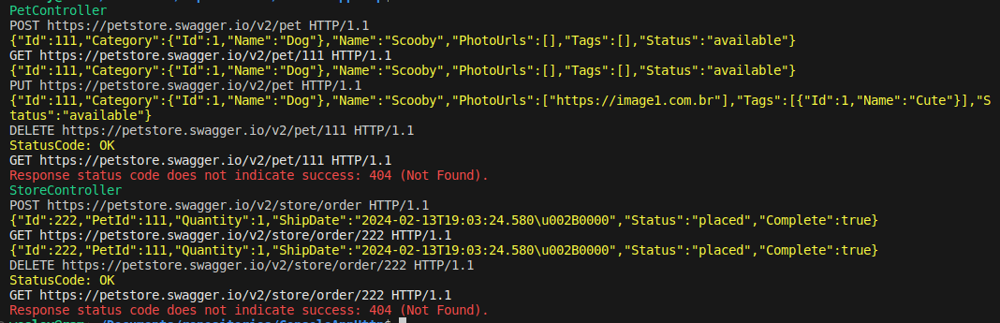

# Console-app-http

Aplicação de console para estudar e testar chamadas HTTP com as bibliotecas do .NET.

Esta aplicação realiza chamadas HTTP para a fake API [Swagger Petstore](https://petstore.swagger.io/).

## HttpService

Implementa um cliente HttpClient para ser utilizado pela aplicação.
Disponibiliza métodos genéricos para os verbos HTTP GET, POST, PUT e DELETE

## Controllers

* PetController: controlador que realiza as chamadas HTTP para o endpoint PET. Realiza um POST, GET, PUT e DELETE sobre um registro:

        PetController
        POST https://petstore.swagger.io/v2/pet HTTP/1.1
        {"Id":111,"Category":{"Id":1,"Name":"Dog"},"Name":"Scooby","PhotoUrls":[],"Tags":[],"Status":"available"}
        GET https://petstore.swagger.io/v2/pet/111 HTTP/1.1
        {"Id":111,"Category":{"Id":1,"Name":"Dog"},"Name":"Scooby","PhotoUrls":[],"Tags":[],"Status":"available"}
        PUT https://petstore.swagger.io/v2/pet HTTP/1.1
        {"Id":111,"Category":{"Id":1,"Name":"Dog"},"Name":"Scooby","PhotoUrls":["https://image1.com.br"],"Tags":[{"Id":1,"Name":"Cute"}],"Status":"available"}
        DELETE https://petstore.swagger.io/v2/pet/111 HTTP/1.1
        StatusCode: OK
        GET https://petstore.swagger.io/v2/pet/111 HTTP/1.1
        Response status code does not indicate success: 404 (Not Found).

* OrderController: controlador que realiza uma ordem de compra de um Pet. Realiza um POST, GET e DELETE sobre um registro:

        StoreController
        POST https://petstore.swagger.io/v2/store/order HTTP/1.1
        {"Id":222,"PetId":111,"Quantity":1,"ShipDate":"2024-02-13T19:03:24.580\u002B0000","Status":"placed","Complete":true}
        GET https://petstore.swagger.io/v2/store/order/222 HTTP/1.1
        {"Id":222,"PetId":111,"Quantity":1,"ShipDate":"2024-02-13T19:03:24.580\u002B0000","Status":"placed","Complete":true}
        DELETE https://petstore.swagger.io/v2/store/order/222 HTTP/1.1
        StatusCode: OK
        GET https://petstore.swagger.io/v2/store/order/222 HTTP/1.1
        Response status code does not indicate success: 404 (Not Found).

## Métodos HTTP

* GET: Recupera um registro
* POST: Cria um registro
* PUT: Atualiza um ou mais campos de um registro
* DELETE: Remove um registro

# Log
